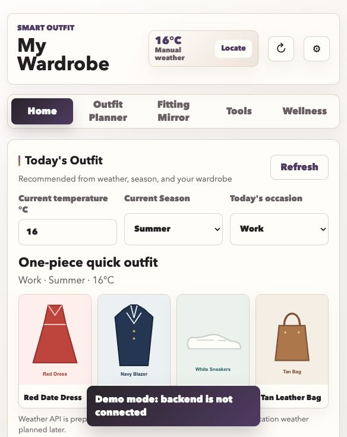
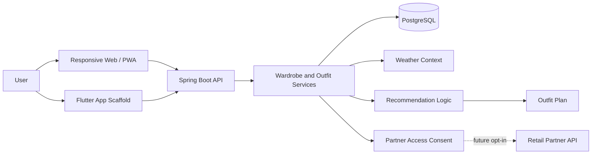
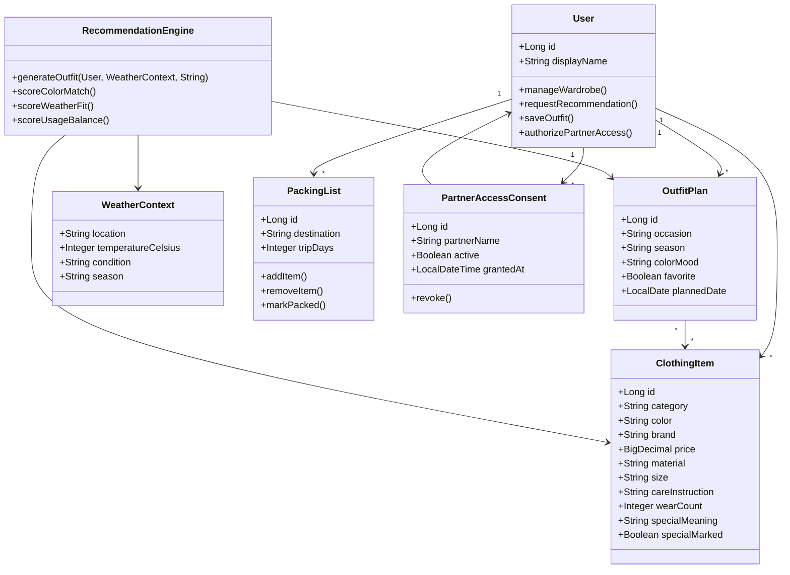

# Smart Outfit

Smart Outfit is a private-first wardrobe intelligence app.
It helps users manage a digital wardrobe, get outfit recommendations, track clothing usage, plan travel packing lists and make better shopping decisions without turning personal style data into a public social feed.

This is my main interview portfolio project because it combines product thinking, backend structure, data modeling, frontend flows, mobile app planning and privacy-aware design.

## Live Demo

- Web demo: https://lilarosa.github.io/smartoutfit/
- Repository: https://github.com/lilarosa/smartoutfit

## Screenshot



## Product Problem

Many people own enough clothes but still struggle with everyday decisions:

- What should I wear today based on weather, occasion and style preference?
- Which items do I actually wear often?
- What should I pack for a trip?
- Am I buying duplicates instead of filling real wardrobe gaps?
- How can the app help without exposing private photos and personal data?

Smart Outfit is designed as a personal decision-support app, not a social fashion feed.

## Target Users

- Private users who want a better overview of their wardrobe
- People who want weather-aware outfit suggestions
- Users who travel and need editable packing lists
- Users who want to reduce duplicate purchases
- Future retail partners, but only through explicit user authorization

## Core Features

- Digital wardrobe with clothing categories and item images
- Batch clothing import concept for first-time setup
- Item detail profiles: brand, size, price, material, care notes, special meaning and wear count
- Weather-aware outfit recommendation logic
- Scenario-based outfit planning for work, casual, travel and special occasions
- Outfit calendar and saved outfit favorites
- Editable travel packing lists
- Wardrobe gap analysis and duplicate-shopping checks
- Color analysis and idle-item organization ideas
- Lightweight wellness page for weight, cycle and daily mood notes
- Consent-based partner integration concept, disabled by default
- Avatar fitting mirror prototype, with realistic AI try-on planned as a future extension

## Privacy Positioning

Smart Outfit is private by default.

- Wardrobe images are personal and should not be public by default.
- Wellness records are sensitive and should be minimized.
- Partner access must be opt-in, scoped and revocable.
- The product should work as a personal app before adding any enterprise integration.
- Future App Store preparation should avoid unnecessary data collection and clearly explain storage, deletion and consent.

## Tech Stack

- Java 21
- Spring Boot
- Spring Data JPA
- PostgreSQL
- Maven
- Static Web/PWA frontend
- Flutter mobile app scaffold

## Architecture Overview



## UML Domain Model



## Recommendation Logic

The recommendation logic is intentionally not presented as a visible UI explanation.
For the user, the app should simply suggest useful outfits. Internally, the logic can consider:

- Weather and temperature
- Season
- Occasion or scenario
- Clothing category compatibility
- Color preference and color harmony
- Recently worn items
- Favorite items and saved outfit history
- Underused clothing items

## Running The Backend

```bash
./mvnw spring-boot:run
```

Then open:

```text
http://localhost:8080/
```

The static frontend can also be opened directly from:

```text
src/main/resources/static/index.html
```

For database-backed features, use the Spring Boot URL.

## Running Tests

Backend:

```bash
./mvnw test
```

Flutter:

```bash
cd mobile_flutter
../.tools/flutter/bin/flutter analyze
../.tools/flutter/bin/flutter test
```

## Interview Talking Points

- I can explain why this app is designed as private-first instead of social-first.
- I can discuss how clothing items, outfit plans, packing lists and partner consent fit into the domain model.
- I can explain why travel packing lists need to be editable, not only generated automatically.
- I can discuss the difference between a prototype avatar fitting mirror and production AI try-on.
- I can explain how a future retail partner integration should remain user-authorized and revocable.
- I can discuss how the same product can be built as a personal app first and extended later without changing its core identity.

## Future Improvements

- Add production-ready image storage and deletion controls
- Improve weather integration with real location permission handling
- Add local-first storage mode for lower compliance risk
- Add a short demo walkthrough section
- Improve the mobile Flutter implementation to match the web feature structure
- Explore AI-assisted clothing classification and realistic try-on as optional premium features
